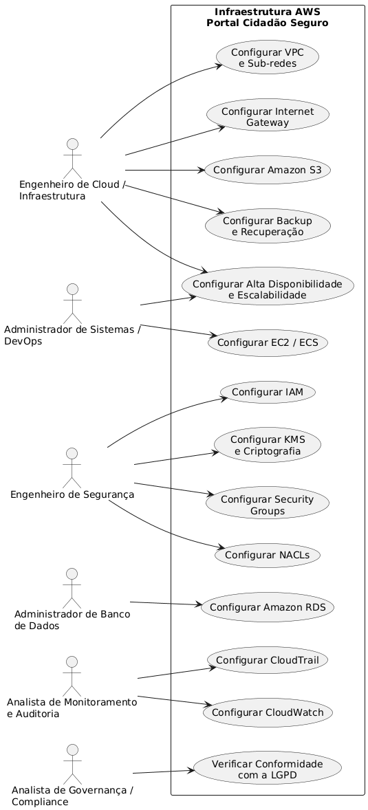
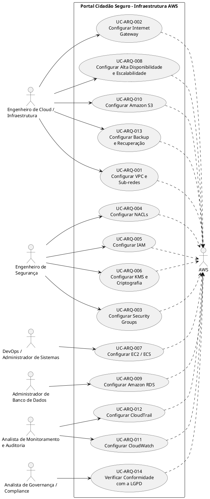

# Casos de uso arquiteturais

- Tema: GovTech – "Portal Cidadão Seguro"
- Data: 2026.2
- Stakeholder: Caio Domingues - Keanu Santos - Eric Lerer - Gabriel Meireles

---

### 1. Introdução

Este documento descreve as necessidades de negócio, restrições e requisitos de infraestrutura da plataforma Portal Cidadão Seguro, além de orientar o planejamento arquitetural da solução em nuvem utilizando a Amazon Web Services (AWS).

### 1.1 Propósito

Definir a visão de escopo e arquitetura lógica e física para a implantação da plataforma Portal Cidadão Seguro na infraestrutura de nuvem AWS, contemplando os requisitos de segurança, escalabilidade, disponibilidade, monitoramento, auditoria e proteção dos dados tratados pela plataforma.

### 1.2 Escopo

Os casos de uso arquiteturais abrangem a configuração e administração da infraestrutura AWS necessária para o funcionamento do Portal Cidadão Seguro, contemplando:

- **Rede e isolamento:** configuração da VPC e das sub-redes públicas e privadas, além da conectividade externa por meio do Internet Gateway.
- **Segurança e controle de acesso:** configuração de Security Groups, NACLs, IAM e mecanismos de criptografia gerenciados pelo AWS KMS.
- **Computação:** configuração e disponibilização dos recursos Amazon EC2 / ECS para execução dos serviços da aplicação.
- **Persistência de dados:** configuração do Amazon RDS para armazenamento das informações estruturadas da plataforma.
- **Armazenamento de arquivos:** configuração do Amazon S3 para armazenamento de documentos, imagens e outros arquivos.
- **Monitoramento e auditoria:** configuração do Amazon CloudWatch para métricas e logs e do AWS CloudTrail para registro das atividades e ações realizadas no ambiente.
- **Disponibilidade e escalabilidade:** configuração dos recursos necessários para alta disponibilidade, utilização de múltiplas Availability Zones e dimensionamento conforme a demanda.
- **Continuidade de negócio:** configuração de mecanismos de backup e recuperação, considerando os objetivos de RPO e RTO definidos no projeto.
- **Governança e conformidade:** aplicação dos controles necessários para atender aos requisitos de segurança, auditoria e proteção de dados relacionados à LGPD.

---

## 2. VISÃO GERAL DOS CASOS DE USO

### 2.1. Atores

| Stakeholder (Perfil) | Necessidade Primária | Expectativa na Nuvem (AWS) |
|---|---|---|
| **Cidadãos** | Utilizar os serviços públicos digitais e realizar solicitações de zeladoria urbana | Disponibilidade e responsividade da plataforma para criação, consulta, atualização e acompanhamento das solicitações |
| **Servidores Públicos** | Analisar solicitações de zeladoria e acompanhar seu atendimento | Acesso confiável às solicitações e aos dados necessários para análise e atualização dos atendimentos |
| **Engenheiro de Cloud / Infraestrutura** | Configurar e administrar a infraestrutura de rede e os recursos de nuvem | VPC, sub-redes, Internet Gateway, disponibilidade e escalabilidade configurados de forma adequada |
| **Engenheiro de Segurança** | Configurar os mecanismos de proteção e controle de acesso da infraestrutura | Security Groups, NACLs, IAM e mecanismos de criptografia configurados para proteger os recursos e dados |
| **DevOps / Administrador de Sistemas** | Configurar os recursos computacionais e disponibilizar os serviços da aplicação | EC2/ECS configurados e disponíveis para execução dos serviços do Portal Cidadão Seguro |
| **Administrador de Banco de Dados** | Configurar e administrar o banco de dados da plataforma | Amazon RDS configurado para armazenar os dados de forma persistente, segura e acessível à aplicação |
| **Desenvolvedor Backend** | Desenvolver e disponibilizar os serviços da aplicação e integrar os recursos de armazenamento | Backend integrado aos recursos AWS necessários, incluindo banco de dados e Amazon S3 |
| **Analista de Monitoramento e Auditoria** | Monitorar a infraestrutura e acompanhar os registros das atividades realizadas | CloudWatch e CloudTrail configurados para centralizar métricas, logs e trilhas de auditoria |
| **Analista de Governança / Compliance** | Verificar o atendimento aos requisitos de governança, segurança e proteção de dados | Recursos e registros disponíveis para auditoria e verificação de conformidade com a LGPD |

### 2.2 Diagrama de casos de Uso

<!--  -->

---

## 3. ESPECIFICAÇÃO DOS CASOS DE USO

### UC-ARQ-001: CONFIGURAR VPC E SUB-REDES

| **Elemento** | **Especificação** |
|---|---|
| **Identificador** | UC-ARQ-001 |
| **Nome** | Configurar VPC e Sub-redes |
| **Versão** | 1.0 |
| **Data** | 17/09/2026 |
| **Status** | Em elaboração |
| **Ator Principal** | Engenheiro de Cloud / Infraestrutura |
| **Ator Secundário** | AWS |
| **Pré-condição** | Conta AWS disponível e permissões para configuração de rede. |
| **Pós-condição** | VPC criada com sub-redes públicas e privadas para organização dos recursos da infraestrutura. |

| **Fluxo Principal** | **Passos** |
|---|---|
| 1. | Engenheiro acessa a infraestrutura AWS. |
| 2. | Cria a VPC destinada ao Portal Cidadão Seguro. |
| 3. | Configura as sub-redes da VPC. |
| 4. | Define as sub-redes públicas e privadas conforme a necessidade dos recursos. |
| 5. | Associa os recursos às sub-redes correspondentes. |
| 6. | Valida o isolamento e a comunicação entre as sub-redes. |

---

### UC-ARQ-002: CONFIGURAR INTERNET GATEWAY

| **Elemento** | **Especificação** |
|---|---|
| **Identificador** | UC-ARQ-002 |
| **Nome** | Configurar Internet Gateway |
| **Versão** | 1.0 |
| **Data** | 17/09/2026 |
| **Status** | Em elaboração |
| **Ator Principal** | Engenheiro de Cloud / Infraestrutura |
| **Ator Secundário** | AWS |
| **Pré-condição** | VPC criada. |
| **Pós-condição** | Internet Gateway associado à VPC para fornecer conectividade externa à infraestrutura que necessitar desse acesso. |

| **Fluxo Principal** | **Passos** |
|---|---|
| 1. | Engenheiro acessa os recursos de rede da AWS. |
| 2. | Cria um Internet Gateway. |
| 3. | Associa o Internet Gateway à VPC. |
| 4. | Configura a conectividade da infraestrutura pública. |
| 5. | Valida a comunicação externa. |

---

### UC-ARQ-003: CONFIGURAR SECURITY GROUPS

| **Elemento** | **Especificação** |
|---|---|
| **Identificador** | UC-ARQ-003 |
| **Nome** | Configurar Security Groups |
| **Versão** | 1.0 |
| **Data** | 17/09/2026 |
| **Status** | Em elaboração |
| **Ator Principal** | Engenheiro de Segurança |
| **Ator Secundário** | AWS |
| **Pré-condição** | Recursos da infraestrutura definidos. |
| **Pós-condição** | Security Groups configurados e associados aos recursos correspondentes. |

| **Fluxo Principal** | **Passos** |
|---|---|
| 1. | Engenheiro acessa a configuração de Security Groups. |
| 2. | Cria as regras necessárias para os recursos da aplicação. |
| 3. | Define as origens e portas permitidas. |
| 4. | Associa os Security Groups aos recursos correspondentes. |
| 5. | Restringe acessos que não sejam necessários. |
| 6. | Valida as regras de comunicação. |

---

### UC-ARQ-004: CONFIGURAR NACLs

| **Elemento** | **Especificação** |
|---|---|
| **Identificador** | UC-ARQ-004 |
| **Nome** | Configurar NACLs |
| **Versão** | 1.0 |
| **Data** | 17/09/2026 |
| **Status** | Em elaboração |
| **Ator Principal** | Engenheiro de Segurança |
| **Ator Secundário** | AWS |
| **Pré-condição** | VPC e sub-redes configuradas. |
| **Pós-condição** | NACLs configuradas nas sub-redes para controle adicional do tráfego. |

| **Fluxo Principal** | **Passos** |
|---|---|
| 1. | Engenheiro acessa as configurações da VPC. |
| 2. | Identifica as sub-redes que necessitam de controle de tráfego. |
| 3. | Configura as regras de entrada e saída das NACLs. |
| 4. | Associa as NACLs às sub-redes correspondentes. |
| 5. | Valida o comportamento das regras de rede. |

---

### UC-ARQ-005: CONFIGURAR IAM

| **Elemento** | **Especificação** |
|---|---|
| **Identificador** | UC-ARQ-005 |
| **Nome** | Configurar IAM |
| **Versão** | 1.0 |
| **Data** | 17/09/2026 |
| **Status** | Em elaboração |
| **Ator Principal** | Engenheiro de Segurança |
| **Ator Secundário** | AWS |
| **Pré-condição** | Recursos AWS definidos e necessidade de controle de acesso identificada. |
| **Pós-condição** | Usuários, serviços e aplicações possuem permissões compatíveis com suas funções. |

| **Fluxo Principal** | **Passos** |
|---|---|
| 1. | Engenheiro acessa o IAM. |
| 2. | Identifica os usuários e serviços que necessitam acessar recursos AWS. |
| 3. | Cria ou configura as identidades necessárias. |
| 4. | Define as permissões correspondentes. |
| 5. | Aplica o princípio do menor privilégio. |
| 6. | Valida os acessos concedidos. |

---

### UC-ARQ-006: CONFIGURAR KMS E CRIPTOGRAFIA

| **Elemento** | **Especificação** |
|---|---|
| **Identificador** | UC-ARQ-006 |
| **Nome** | Configurar KMS e Criptografia |
| **Versão** | 1.0 |
| **Data** | 17/09/2026 |
| **Status** | Em elaboração |
| **Ator Principal** | Engenheiro de Segurança |
| **Ator Secundário** | AWS |
| **Pré-condição** | Recursos que armazenam ou processam dados sensíveis definidos. |
| **Pós-condição** | Dados protegidos em trânsito e em repouso, utilizando mecanismos de criptografia previstos na arquitetura. |

| **Fluxo Principal** | **Passos** |
|---|---|
| 1. | Engenheiro identifica os dados que necessitam de proteção. |
| 2. | Configura mecanismos de criptografia em trânsito utilizando HTTPS/TLS. |
| 3. | Configura a proteção dos dados em repouso. |
| 4. | Configura o gerenciamento das chaves criptográficas pelo AWS KMS. |
| 5. | Valida a proteção dos dados. |

---

### UC-ARQ-007: CONFIGURAR EC2 / ECS

| **Elemento** | **Especificação** |
|---|---|
| **Identificador** | UC-ARQ-007 |
| **Nome** | Configurar EC2 / ECS |
| **Versão** | 1.0 |
| **Data** | 17/09/2026 |
| **Status** | Em elaboração |
| **Ator Principal** | DevOps / Administrador de Sistemas |
| **Ator Secundário** | AWS |
| **Pré-condição** | VPC e sub-rede destinadas à computação configuradas. |
| **Pós-condição** | Ambiente computacional preparado para execução dos serviços da aplicação. |

| **Fluxo Principal** | **Passos** |
|---|---|
| 1. | Administrador acessa o serviço de computação escolhido. |
| 2. | Configura o recurso de computação. |
| 3. | Associa o recurso à VPC e à sub-rede correspondente. |
| 4. | Associa as configurações de segurança necessárias. |
| 5. | Disponibiliza o ambiente para execução da aplicação. |
| 6. | Valida a execução dos serviços. |

---

### UC-ARQ-008: CONFIGURAR ALTA DISPONIBILIDADE E ESCALABILIDADE

| **Elemento** | **Especificação** |
|---|---|
| **Identificador** | UC-ARQ-008 |
| **Nome** | Configurar Alta Disponibilidade e Escalabilidade |
| **Versão** | 1.0 |
| **Data** | 17/09/2026 |
| **Status** | Em elaboração |
| **Ator Principal** | Engenheiro de Cloud / Infraestrutura |
| **Ator Secundário** | AWS |
| **Pré-condição** | Recursos de computação e banco definidos. |
| **Pós-condição** | Infraestrutura preparada para distribuição de recursos, utilização de múltiplas Availability Zones e dimensionamento conforme demanda. |

| **Fluxo Principal** | **Passos** |
|---|---|
| 1. | Engenheiro avalia os componentes que necessitam de alta disponibilidade. |
| 2. | Distribui os componentes aplicáveis entre múltiplas Availability Zones. |
| 3. | Configura mecanismos de escalabilidade horizontal. |
| 4. | Configura o dimensionamento automático dos recursos, quando aplicável. |
| 5. | Valida o comportamento da infraestrutura diante de variações de demanda. |

---

### UC-ARQ-009: CONFIGURAR AMAZON RDS

| **Elemento** | **Especificação** |
|---|---|
| **Identificador** | UC-ARQ-009 |
| **Nome** | Configurar Amazon RDS |
| **Versão** | 1.0 |
| **Data** | 17/09/2026 |
| **Status** | Em elaboração |
| **Ator Principal** | Administrador de Banco de Dados |
| **Ator Secundário** | AWS |
| **Pré-condição** | VPC e sub-rede privada configuradas. |
| **Pós-condição** | Banco relacional configurado para persistência dos dados da plataforma e sem exposição direta à internet pública. |

| **Fluxo Principal** | **Passos** |
|---|---|
| 1. | DBA acessa o serviço Amazon RDS. |
| 2. | Configura a instância do banco de dados relacional. |
| 3. | Associa o banco à estrutura de rede privada. |
| 4. | Configura o acesso necessário para os serviços da aplicação. |
| 5. | Configura os mecanismos de segurança e proteção previstos. |
| 6. | Valida a comunicação entre aplicação e banco. |

---

### UC-ARQ-010: CONFIGURAR AMAZON S3

| **Elemento** | **Especificação** |
|---|---|
| **Identificador** | UC-ARQ-010 |
| **Nome** | Configurar Amazon S3 |
| **Versão** | 1.0 |
| **Data** | 17/09/2026 |
| **Status** | Em elaboração |
| **Ator Principal** | Engenheiro de Cloud / Infraestrutura |
| **Ator Secundário** | AWS |
| **Pré-condição** | Conta AWS disponível e necessidade de armazenamento de arquivos definida. |
| **Pós-condição** | Bucket configurado para armazenamento dos arquivos da plataforma. |

| **Fluxo Principal** | **Passos** |
|---|---|
| 1. | Engenheiro acessa o Amazon S3. |
| 2. | Cria o bucket destinado à plataforma. |
| 3. | Configura as permissões de acesso necessárias. |
| 4. | Configura a aplicação para utilizar o armazenamento. |
| 5. | Valida o armazenamento e recuperação dos arquivos. |

---

### UC-ARQ-011: CONFIGURAR CLOUDWATCH

| **Elemento** | **Especificação** |
|---|---|
| **Identificador** | UC-ARQ-011 |
| **Nome** | Configurar CloudWatch |
| **Versão** | 1.0 |
| **Data** | 17/09/2026 |
| **Status** | Em elaboração |
| **Ator Principal** | Analista de Monitoramento e Auditoria |
| **Ator Secundário** | AWS |
| **Pré-condição** | Recursos da infraestrutura em operação. |
| **Pós-condição** | Métricas, logs e eventos relevantes centralizados para monitoramento. |

| **Fluxo Principal** | **Passos** |
|---|---|
| 1. | Analista acessa o Amazon CloudWatch. |
| 2. | Configura a coleta de métricas e logs relevantes. |
| 3. | Centraliza os dados de monitoramento. |
| 4. | Acompanha o comportamento da infraestrutura. |
| 5. | Identifica falhas ou comportamentos anormais. |

---

### UC-ARQ-012: CONFIGURAR CLOUDTRAIL

| **Elemento** | **Especificação** |
|---|---|
| **Identificador** | UC-ARQ-012 |
| **Nome** | Configurar CloudTrail |
| **Versão** | 1.0 |
| **Data** | 17/09/2026 |
| **Status** | Em elaboração |
| **Ator Principal** | Analista de Monitoramento e Auditoria |
| **Ator Secundário** | AWS |
| **Pré-condição** | Conta AWS e recursos disponíveis para auditoria. |
| **Pós-condição** | Ações relevantes realizadas no ambiente AWS registradas para rastreamento e investigação. |

| **Fluxo Principal** | **Passos** |
|---|---|
| 1. | Analista acessa o AWS CloudTrail. |
| 2. | Configura o registro das atividades da conta AWS. |
| 3. | Define os eventos relevantes para auditoria. |
| 4. | Valida o registro das ações executadas. |
| 5. | Utiliza os registros para rastreamento e investigação quando necessário. |

---

### UC-ARQ-013: CONFIGURAR BACKUP E RECUPERAÇÃO

| **Elemento** | **Especificação** |
|---|---|
| **Identificador** | UC-ARQ-013 |
| **Nome** | Configurar Backup e Recuperação |
| **Versão** | 1.0 |
| **Data** | 17/09/2026 |
| **Status** | Em elaboração |
| **Ator Principal** | Engenheiro de Cloud / Infraestrutura |
| **Ator Secundário** | AWS |
| **Pré-condição** | Recursos de armazenamento e persistência configurados. |
| **Pós-condição** | Mecanismos de backup e recuperação definidos para reduzir os impactos de falhas e indisponibilidades. |

| **Fluxo Principal** | **Passos** |
|---|---|
| 1. | Engenheiro identifica os dados e recursos que necessitam de recuperação. |
| 2. | Define a estratégia de backup da infraestrutura. |
| 3. | Configura os mecanismos de recuperação disponíveis nos serviços utilizados. |
| 4. | Define os procedimentos de restauração. |
| 5. | Valida a recuperação dos dados e serviços. |
| 6. | Verifica o atendimento aos objetivos de RPO e RTO definidos. |

---

### UC-ARQ-014: VERIFICAR CONFORMIDADE COM A LGPD

| **Elemento** | **Especificação** |
|---|---|
| **Identificador** | UC-ARQ-014 |
| **Nome** | Verificar Conformidade com a LGPD |
| **Versão** | 1.0 |
| **Data** | 17/09/2026 |
| **Status** | Em elaboração |
| **Ator Principal** | Analista de Governança / Compliance |
| **Ator Secundário** | AWS |
| **Pré-condição** | Infraestrutura e tratamento de dados definidos. |
| **Pós-condição** | Tratamento dos dados avaliado em relação aos requisitos de proteção de dados e às políticas aplicáveis. |

| **Fluxo Principal** | **Passos** |
|---|---|
| 1. | Analista identifica os dados pessoais tratados pela plataforma. |
| 2. | Avalia os mecanismos de proteção aplicados aos dados. |
| 3. | Verifica os controles de acesso e rastreabilidade. |
| 4. | Analisa os registros necessários para auditoria. |
| 5. | Verifica a aderência aos requisitos aplicáveis da LGPD. |
| 6. | Registra os resultados da análise de conformidade. |