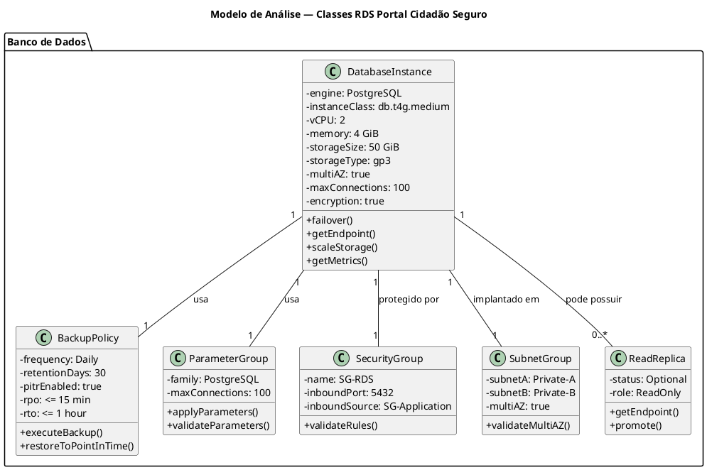

# Modelo de Análise — Dimensionamento de Banco de Dados (RDS)

## Portal Cidadão Seguro — Arquitetura em Nuvem AWS

| Informação | Valor |
|---|---|
| Projeto | Portal Cidadão Seguro — Plataforma GovTech |
| Documento | Modelo de Análise (Classes de Análise) — Dimensionamento de Banco de Dados (RDS) |
| Versão | 1.0 |
| Status | Em Desenvolvimento |
| Disciplina | Projeto de Cloud |
| Fase RUP/UP | Elaboration |
| Banco de dados | Amazon RDS for PostgreSQL |

---

# 1. Introdução

## 1.1. Propósito

Este documento apresenta o modelo de análise utilizado para o dimensionamento do banco de dados relacional do **Portal Cidadão Seguro**, utilizando o **Amazon RDS for PostgreSQL**.

O dimensionamento considera um cenário de implantação para **um único município do Estado do Rio de Janeiro**, com o Portal funcionando como uma plataforma que reúne diferentes serviços públicos digitais. No cenário inicial, a **Zeladoria Urbana** é o serviço analisado, mantendo-se a arquitetura preparada para a inclusão de outros serviços.

O objetivo é relacionar o workload esperado aos requisitos de persistência, disponibilidade, segurança, continuidade e escalabilidade, transformando esses requisitos em uma configuração inicial de RDS documentada e justificável.

## 1.2. Escopo

O dimensionamento considera:

- aproximadamente **1.000.000 de usuários** como capacidade de projeto;
- aproximadamente **52.000 acessos diários** ao Portal;
- **20%** desses acessos utilizando a Zeladoria Urbana;
- **5%** dos acessos à Zeladoria gerando uma nova solicitação;
- média de **4 registros históricos por solicitação durante seu ciclo de vida**;
- persistência de dados transacionais no RDS;
- armazenamento de imagens e documentos no Amazon S3, mantendo no RDS apenas metadados e referências;
- PostgreSQL em Amazon RDS;
- implantação Multi-AZ;
- backup automático e PITR;
- criptografia, rede privada e controle de acesso por Security Group;
- limite operacional de **100 conexões**;
- storage inicial de **50 GiB**, com Auto Scaling proposto até **200 GiB**.

## 1.3. Fora do escopo

Não fazem parte do dimensionamento inicial:

- armazenamento dos arquivos físicos no RDS;
- banco NoSQL;
- dimensionamento para todo o Estado do Rio de Janeiro;
- Read Replica como componente obrigatório da primeira versão;
- quantidade definitiva de EC2/ECS;
- custos de serviços que não fazem parte da configuração inicial do RDS.

---

# 2. Premissas de Dimensionamento

## 2.1. Referências de escala

A Prefeitura do Rio registrou **1 milhão de usuários cadastrados no Carioca Digital em 2020**. Para este projeto, esse valor é utilizado como referência para definir a capacidade de projeto de usuários do Portal. 

Para a carga diária, o grupo adotou **52.000 acessos/dia**, obtidos a partir da referência de aproximadamente 19 milhões de sessões anuais e da divisão por 365 dias. Esse valor é tratado neste documento como **premissa de projeto**, e não como distribuição observada minuto a minuto.

> **Nota de consistência:** o material do IplanRio de 2024 também apresenta uma média aproximada de 70 mil sessões por dia. O presente dimensionamento mantém os **52.000 acessos/dia** como cenário adotado pelo grupo para manter a mesma base de cálculo já utilizada no trabalho.

## 2.2. Premissas funcionais para o workload

| Premissa | Valor | Classificação |
|---|---:|---|
| Usuários de projeto | 1.000.000 | Referência de escala |
| Acessos ao Portal | 52.000/dia | Premissa derivada |
| Uso da Zeladoria | 20% | Premissa de projeto |
| Acessos à Zeladoria | 10.400/dia | Derivado |
| Acessos da Zeladoria que geram solicitação | 5% | Premissa de projeto |
| Novas solicitações | 520/dia | Derivado |
| Históricos por solicitação | 4 | Premissa de projeto |
| Fator de pico | 10× | Margem de projeto |

## 2.3. Premissas de persistência

O banco deverá armazenar os dados estruturados do Portal, incluindo usuários, catálogo de serviços, categorias, solicitações, histórico e metadados de anexos.

Os arquivos físicos, como imagens e documentos, serão direcionados ao **Amazon S3**. O banco manterá somente a referência necessária para localizar e controlar esses arquivos.

---

# 3. Visão Geral do Dimensionamento

## 3.1. Carga do Portal

Como o Portal reúne serviços, a carga inicial não deve ser considerada apenas pela utilização da Zeladoria. O carregamento da interface pode consultar o catálogo de serviços disponíveis.

Assim, foi adotada a premissa de uma consulta ao catálogo por acesso, resultando em uma carga comum a todos os usuários do Portal.

## 3.2. Carga da Zeladoria Urbana

A Zeladoria representa 20% dos acessos do Portal no cenário-base.

O acesso ao serviço pode consultar, de forma simplificada:

- categorias disponíveis;
- solicitações do usuário;
- metadados dos anexos.

Essas consultas são utilizadas na **memória de cálculo separada**, conforme a estrutura solicitada para a disciplina.

## 3.3. Natureza do workload

O workload projetado é predominantemente de **leitura**, enquanto a carga de escrita é menor e está relacionada principalmente à criação e atualização das solicitações.

Isso influencia a decisão de começar com uma única instância Multi-AZ e deixar a Read Replica como mecanismo de evolução, caso o monitoramento demonstre necessidade de ampliar a capacidade de leitura.

---

# 4. Dados Persistidos

## 4.1. Entidades principais

### User

Dados cadastrais dos cidadãos e servidores:

```text
id
name
email
cpf
user_type
created_at
updated_at
```

### Service

Catálogo de serviços disponíveis no Portal:

```text
id
name
description
active
created_at
updated_at
```

### Category

Categorias vinculadas aos serviços:

```text
id
service_id
name
description
active
```

### Solicitacao

Dados da solicitação realizada pelo cidadão:

```text
id
protocol
user_id
service_id
category_id
description
status
latitude
longitude
address
created_at
updated_at
closed_at
```

### SolicitacaoHistorico

Rastreabilidade das alterações da solicitação:

```text
id
solicitacao_id
status
changed_by
comment
created_at
```

### Attachment

Metadados dos arquivos associados à solicitação:

```text
id
solicitacao_id
file_name
file_key
content_type
file_size
created_at
```

## 4.2. Separação entre RDS e S3

```text
RDS
├── User
├── Service
├── Category
├── Solicitacao
├── SolicitacaoHistorico
└── Attachment
       └── file_key

S3
└── Imagens / documentos / arquivos
```

A decisão mantém o RDS concentrado nos dados transacionais e evita que arquivos grandes aumentem desnecessariamente o banco relacional.

---

# 5. Classes de Análise do RDS

## 5.1. DatabaseInstance

**Responsabilidade:** representar a instância principal do PostgreSQL, sua capacidade, storage, disponibilidade e segurança.

### Configuração inicial proposta

| Atributo | Valor |
|---|---|
| Engine | PostgreSQL |
| Classe | `db.t4g.medium` |
| vCPU | 2 |
| Memória | 4 GiB |
| Storage | 50 GiB gp3 |
| Auto Scaling | Até 200 GiB |
| Multi-AZ | Sim |
| Max connections | 100 |
| Criptografia | Sim |
| Proteção contra exclusão acidental | Sim |
| Monitoramento | CloudWatch |

## 5.2. BackupPolicy

| Atributo | Valor |
|---|---|
| Backup automático | Sim |
| Retenção | 30 dias |
| PITR | Habilitado |
| RPO | ≤ 15 min |
| RTO | ≤ 1 h |

## 5.3. ParameterGroup

O Parameter Group centraliza as configurações específicas do PostgreSQL.

A única configuração definida no primeiro dimensionamento é:

```text
max_connections = 100
```

Os demais parâmetros permanecem no padrão até que testes da aplicação forneçam evidências para ajustes adicionais.

## 5.4. SecurityGroup

Regra proposta:

```text
TCP 5432
Origem: Security Group da aplicação
```

O banco não deve aceitar conexões diretamente da Internet.

## 5.5. SubnetGroup

O RDS será implantado em sub-redes privadas distribuídas em múltiplas Availability Zones:

```text
Private Subnet A → AZ A
Private Subnet B → AZ B
```

## 5.6. ReadReplica

A Read Replica não fará parte da implantação inicial.

Ela será considerada como mecanismo de evolução quando métricas demonstrarem pressão de leitura ou quando houver necessidade de separar consultas analíticas do workload transacional.

---

# 6. Diagrama de Classes de Análise



---

# 7. Matriz de Rastreabilidade

| Requisito / Objetivo | Caso de Uso | Classe de Análise | Serviço AWS | Configuração |
|---|---|---|---|---|
| Persistência | UC-ARQ-009 | DatabaseInstance | RDS PostgreSQL | PostgreSQL |
| Alta disponibilidade | UC-ARQ-008 | DatabaseInstance | RDS | Multi-AZ |
| RPO ≤ 15 min | UC-ARQ-013 | BackupPolicy | RDS | PITR |
| RTO ≤ 1 h | UC-ARQ-013 | DatabaseInstance | RDS | Failover |
| Criptografia | UC-ARQ-006 | DatabaseInstance | RDS/KMS | Encryption |
| Controle de acesso | UC-ARQ-003 | SecurityGroup | VPC/SG | Porta 5432 restrita |
| Isolamento | UC-ARQ-001 | SubnetGroup | VPC | Private Subnets |
| Monitoramento | UC-ARQ-011 | DatabaseInstance | CloudWatch | Métricas/Logs |
| Escalabilidade de leitura | UC-ARQ-008 | ReadReplica | RDS | Evolução futura |
| Armazenamento de arquivos | UC-ARQ-010 | — | S3 | Arquivos fora do RDS |
| LGPD | UC-ARQ-014 | DatabaseInstance / BackupPolicy | RDS/KMS | Proteção e auditoria |

---

# 8. Justificativas Técnicas

| Decisão | Justificativa |
|---|---|
| PostgreSQL | Adequado ao modelo relacional e às relações entre usuários, serviços, categorias e solicitações. |
| Amazon RDS | Serviço gerenciado, reduzindo a administração direta do servidor de banco. |
| `db.t4g.medium` | Capacidade inicial compatível com o workload projetado e com possibilidade de escalabilidade vertical. |
| 50 GiB | O cálculo bruto de dados estruturados é baixo; o volume inicial fornece margem para índices, overhead, crescimento e novos serviços. |
| gp3 | O workload estimado de IOPS é muito inferior ao baseline adotado para o storage, evitando provisionamento adicional inicial. |
| Auto Scaling até 200 GiB | Permite crescimento sem necessidade de superdimensionar o volume inicial. |
| Multi-AZ | Atende ao requisito de alta disponibilidade e reduz o impacto de falhas da infraestrutura. |
| Private Subnets | Impedem exposição direta do banco à Internet. |
| Security Group restritivo | Permite acesso somente à camada autorizada da aplicação. |
| KMS | Protege os dados armazenados por criptografia. |
| TLS | Protege os dados durante a comunicação com o banco. |
| Backup + PITR | Atendem à estratégia de recuperação e aos objetivos de RPO/RTO. |
| `max_connections = 100` | Limite operacional inicial com margem para concorrência e crescimento. |
| Sem Read Replica inicialmente | A carga estimada ainda não demonstra necessidade de escalar horizontalmente as leituras. |
| S3 para arquivos | Evita aumentar o armazenamento transacional do PostgreSQL com arquivos grandes. |

---

# 9. Trade-offs

| Decisão | Alternativa | Vantagem | Desvantagem |
|---|---|---|---|
| `db.t4g.medium` | Instância maior | Menor custo inicial | Menor margem de CPU/RAM |
| Multi-AZ | Single-AZ | Alta disponibilidade | Maior custo |
| 50 GiB | Storage maior | Evita superdimensionamento | Pode exigir expansão futura |
| gp3 | Storage mais performático | Melhor relação custo/desempenho | Menor desempenho máximo |
| Sem Read Replica | Read Replica | Menor custo inicial | Leituras continuam na instância principal |
| S3 para arquivos | RDS para arquivos | Banco menor e responsabilidades separadas | Exige integração com S3 |
| 100 conexões | Limite menor | Maior margem para crescimento | Mais concorrência potencial sobre o banco |

---

# 10. Riscos e Mitigações

| Risco | Probabilidade | Impacto | Mitigação |
|---|---|---|---|
| Crescimento acima do previsto | Média | Alto | Auto Scaling de storage e monitoramento |
| Carga de leitura maior | Média | Médio/Alto | Monitoramento e Read Replica se necessária |
| Esgotamento de conexões | Média | Alto | `max_connections=100` e controle do pool |
| Falha da AZ primária | Baixa | Alto | Multi-AZ |
| Perda de dados | Baixa | Crítico | Backup + PITR |
| Dados expostos | Baixa | Crítico | Private Subnets + SG + KMS/TLS |
| Custo acima do previsto | Média | Médio | Pricing Calculator e acompanhamento de custos |
| Inclusão de novos serviços | Média | Médio | Arquitetura modular e escalável |

---

# 11. Entregáveis Separados

## 11.1. Memória de Cálculo — XLSX

A **memória de cálculo detalhada não faz parte deste Markdown**. Ela deve ser entregue separadamente em planilha.

**Arquivo:** [`dimensionamento_rds_portal_cidadao_seguro_memoria.xlsx`](./Memoria_Calculo_RDS_Portal_Cidadao_Seguro.xlsx)

A planilha contém:

- premissas;
- workload;
- carga do Portal;
- carga da Zeladoria;
- escritas;
- crescimento dos dados;
- storage;
- CPU/memória/conexões;
- IOPS;
- disponibilidade;
- fontes e referências.

## 11.2. Estimativa de Custo — Print da AWS Pricing Calculator

A **estimativa de custo também é um entregável separado** e deve ser comprovada pelo print da AWS Pricing Calculator.

Configuração utilizada:

```text
Amazon RDS for PostgreSQL
Classe: db.t4g.medium
Multi-AZ
Storage: 50 GiB gp3
Backup: retenção de 30 dias
Read Replica: não utilizada inicialmente
RDS Proxy: não utilizado
```

Resultado obtido na calculadora:

> **US$ 110,42/mês**

**Evidência:** inserir o print da tela da AWS Pricing Calculator no trabalho/anexo.

---

# 12. Checklist da Entrega

O modelo de referência solicita cinco itens principais: diagrama de classes, atributos e relacionamentos, memória de cálculo, justificativas técnicas e estimativa de custo.

### Diagrama de Classes (PlantUML)

**Atendido neste documento.**

### Atributos e Relacionamentos

**Atendidos neste documento e no diagrama.**

### Memória de Cálculo

**Entregue separadamente em XLSX.**

### Justificativas Técnicas

**Atendidas neste documento.**

### Estimativa de Custo

**Entregue separadamente por meio do print da AWS Pricing Calculator.**

---

# 13. Considerações Finais

O dimensionamento foi construído para um cenário de **um município**, considerando aproximadamente **52.000 acessos diários ao Portal** e uma utilização inicial de **20% da Zeladoria Urbana**.

A arquitetura proposta é predominantemente orientada a leitura, com carga de escrita significativamente menor. O RDS inicial utiliza PostgreSQL em **Multi-AZ**, armazenamento **gp3**, **50 GiB** iniciais, Auto Scaling até **200 GiB**, limite de **100 conexões**, backup automático e PITR.

A Read Replica permanece como mecanismo de evolução e deverá ser adicionada somente caso as métricas do ambiente demonstrem necessidade.

O custo estimado pela AWS Pricing Calculator foi de **US$ 110,42 por mês**, conforme print a ser anexado ao trabalho.

---

# 14. Referências

- Prefeitura do Rio — Portal Carioca Digital atinge a marca de um milhão de usuários cadastrados (2020):
  https://prefeitura.rio/iplanrio/portal-carioca-digital-atinge-a-marca-de-um-milhao-de-usuarios-cadastrados/
- IplanRio — Principais Entregas 2024:
  https://iplanrio.prefeitura.rio/wp-content/uploads/sites/43/2024/12/Principais-Entregas-IplanRio-2024.pdf
- Documentos do projeto Portal Cidadão Seguro: Documento de Visão, Requisitos Suplementares, Casos de Uso Arquiteturais e Modelo de Análise (Pacotes/Subsistemas).
- Modelo de referência da disciplina: Dimensionamento RDS / SwiftTrack IoT.
- AWS Pricing Calculator: https://calculator.aws/
