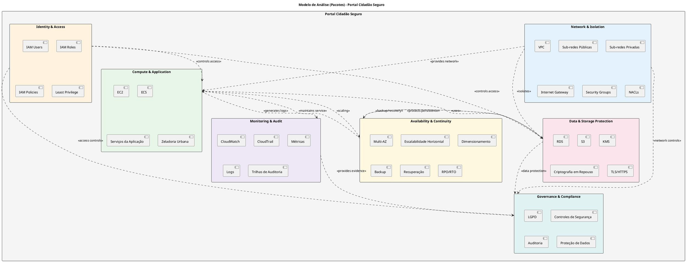

# Modelo de Análise (Pacotes/Subsistemas)

## PORTAL CIDADÃO SEGURO - ARQUITETURA EM NUVEM AWS

| **Informação do Documento** | |
| :--- | :--- |
| **Projeto** | Portal Cidadão Seguro - Plataforma GovTech |
| **Documento** | Modelo de Análise (Pacotes/Subsistemas) |
| **Versão** | 1.0 |
| **Data** | 19/09/2026 |
| **Status** | Em Desenvolvimento |
| **Responsável** | Caio Domingues - Keanu Santos - Bernardo Meireles - Eric Lerer |
| **Disciplina** | Projeto de Cloud |
| **Fase RUP/UP** | Elaboration |

---

## 1. INTRODUÇÃO

### 1.1. Propósito

Este documento apresenta o **Modelo de Análise (Pacotes/Subsistemas)** para a arquitetura da plataforma **Portal Cidadão Seguro** na Amazon Web Services (AWS).

O modelo organiza os principais componentes arquiteturais da solução em pacotes coesos, facilitando a compreensão da infraestrutura, a manutenção e a evolução da arquitetura, além de permitir a rastreabilidade entre os requisitos definidos no projeto, os casos de uso arquiteturais e os elementos técnicos da infraestrutura AWS.

O modelo é derivado diretamente dos seguintes artefatos:

- **Documento de Visão** - Portal Cidadão Seguro
- **Documento de Requisitos Suplementares** - Portal Cidadão Seguro
- **Casos de Uso Arquiteturais** - Portal Cidadão Seguro
- **Requisitos relacionados à segurança, disponibilidade, escalabilidade, monitoramento, auditoria e LGPD**

### 1.2. Escopo

O modelo abrange os subsistemas arquiteturais necessários para sustentar o funcionamento do **Portal Cidadão Seguro**, incluindo o módulo **Zeladoria Urbana**.

Os principais elementos contemplados são:

- **Rede e isolamento:** Amazon VPC, sub-redes públicas e privadas e Internet Gateway.
- **Segurança de rede:** Security Groups e Network Access Control Lists (NACLs).
- **Identidade e controle de acesso:** AWS IAM e princípio do menor privilégio.
- **Computação:** Amazon EC2 / ECS para execução dos serviços da aplicação.
- **Persistência:** Amazon RDS para armazenamento dos dados estruturados.
- **Armazenamento de arquivos:** Amazon S3 para imagens, documentos e outros arquivos.
- **Proteção de dados:** AWS KMS, criptografia em trânsito e em repouso.
- **Monitoramento:** Amazon CloudWatch para métricas, eventos e logs.
- **Auditoria:** AWS CloudTrail para registro das ações realizadas no ambiente AWS.
- **Alta disponibilidade e escalabilidade:** utilização de múltiplas Availability Zones e mecanismos de dimensionamento.
- **Continuidade:** mecanismos de backup e recuperação considerando RPO e RTO.
- **Governança e conformidade:** controles relacionados à proteção de dados e à LGPD.

O módulo **Zeladoria Urbana** representa o serviço funcional do portal que permite aos cidadãos realizar e acompanhar solicitações de serviços de zeladoria urbana. Sua persistência utiliza os componentes arquiteturais descritos neste documento.

### 1.3. Definições e Siglas

| **Sigla** | **Definição** |
| :--- | :--- |
| **AWS** | Amazon Web Services |
| **VPC** | Virtual Private Cloud |
| **IAM** | Identity and Access Management |
| **KMS** | Key Management Service |
| **SG** | Security Group |
| **NACL** | Network Access Control List |
| **EC2** | Elastic Compute Cloud |
| **ECS** | Elastic Container Service |
| **RDS** | Relational Database Service |
| **S3** | Simple Storage Service |
| **TLS** | Transport Layer Security |
| **LGPD** | Lei Geral de Proteção de Dados |
| **RPO** | Recovery Point Objective |
| **RTO** | Recovery Time Objective |
| **AZ** | Availability Zone |
| **CRUD** | Create, Read, Update, Delete |

### 1.4. Referências

- Documento de Visão - Portal Cidadão Seguro
- Documento de Requisitos Suplementares - Portal Cidadão Seguro
- Casos de Uso Arquiteturais - Portal Cidadão Seguro
- Arquitetura da Nuvem AWS - Portal Cidadão Seguro
- Lei Geral de Proteção de Dados (LGPD)

---

# 2. VISÃO GERAL DOS PACOTES

## 2.1. Diagrama de Pacotes (PlantUML)

