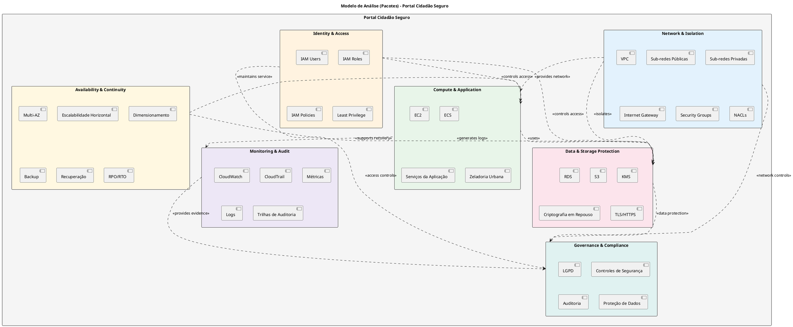
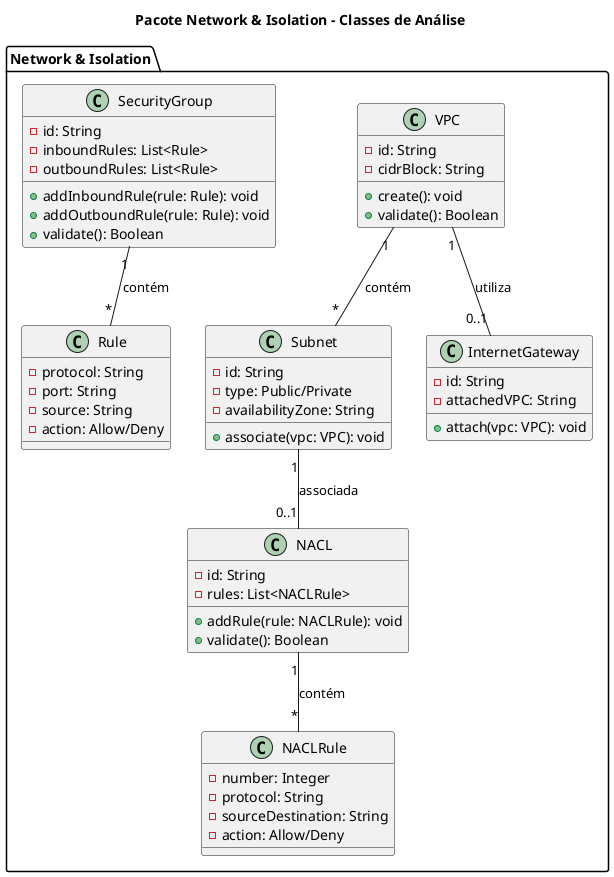
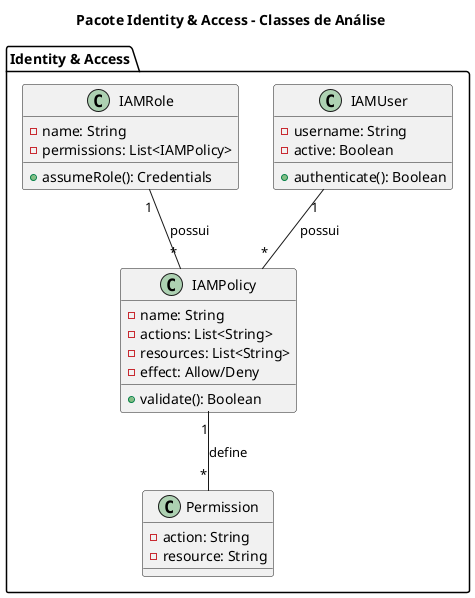
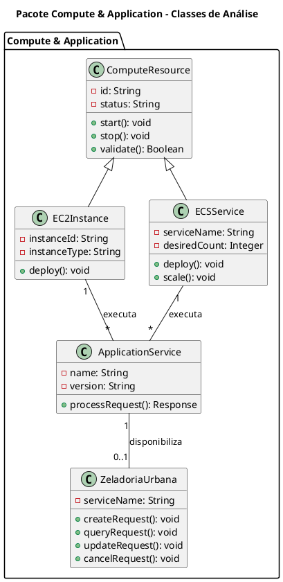
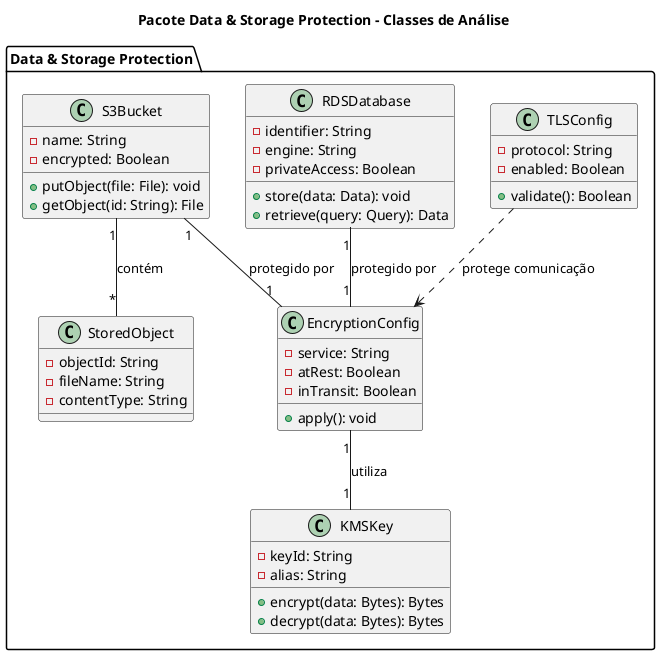
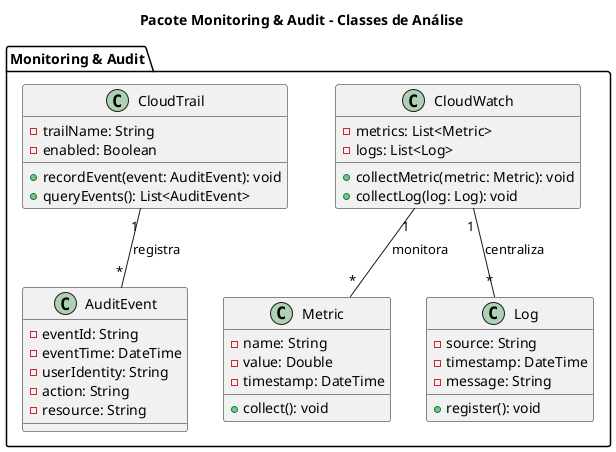
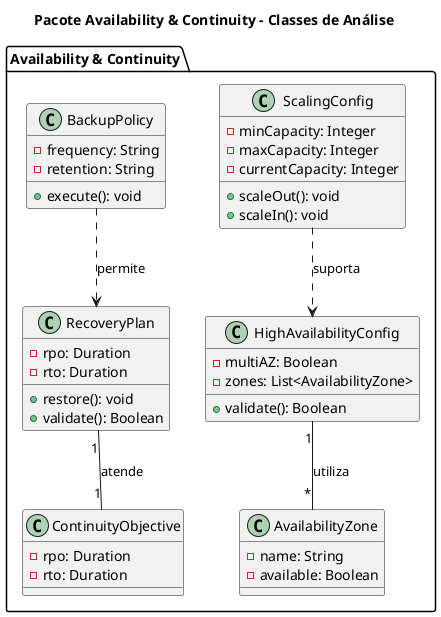
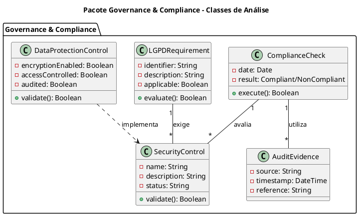
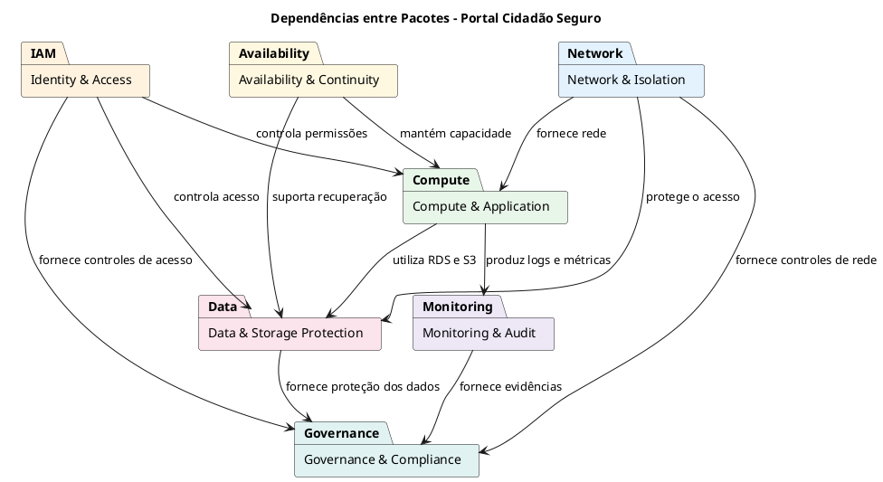

# Modelo de Análise (Pacotes/Subsistemas)

## PORTAL CIDADÃO SEGURO - ARQUITETURA EM NUVEM AWS

| **Informação do Documento** | |
| :--- | :--- |
| **Projeto** | Portal Cidadão Seguro - Plataforma GovTech |
| **Documento** | Modelo de Análise (Pacotes/Subsistemas) |
| **Versão** | 1.0 |
| **Data** | 20/09/2026 |
| **Status** | Em Desenvolvimento |
| **Responsável** | Caio Domingues - Keanu Santos - Eric Lerer - Gabriel Meireles |
| **Disciplina** | Projeto de Cloud |
| **Fase RUP/UP** | Elaboration |

---

# 1. INTRODUÇÃO

## 1.1. Propósito

Este documento apresenta o **Modelo de Análise (Pacotes/Subsistemas)** para a arquitetura do **Portal Cidadão Seguro** na Amazon Web Services (AWS).

O modelo organiza os principais componentes da infraestrutura em pacotes coesos, facilitando a compreensão, manutenção e evolução da arquitetura, além de permitir a rastreabilidade entre os requisitos definidos no projeto, os casos de uso arquiteturais e os elementos técnicos utilizados na solução.

O modelo é derivado diretamente dos seguintes artefatos:

- **Documento de Visão** - Portal Cidadão Seguro
- **Documento de Requisitos Suplementares** - Portal Cidadão Seguro
- **Casos de Uso Arquiteturais** - Portal Cidadão Seguro
- **Requisitos de segurança, disponibilidade, escalabilidade, monitoramento, auditoria e proteção de dados**

## 1.2. Escopo

O modelo abrange os subsistemas arquiteturais necessários para sustentar o funcionamento do **Portal Cidadão Seguro**, incluindo o módulo **Zeladoria Urbana**.

O escopo contempla:

- **Rede e isolamento:** Amazon VPC, sub-redes públicas e privadas e Internet Gateway.
- **Segurança de rede:** Security Groups e Network Access Control Lists (NACLs).
- **Identidade e controle de acesso:** AWS IAM e aplicação do princípio do menor privilégio.
- **Computação:** Amazon EC2 / ECS para execução dos serviços da aplicação.
- **Persistência:** Amazon RDS para armazenamento dos dados estruturados da plataforma.
- **Armazenamento de arquivos:** Amazon S3 para imagens, documentos e outros arquivos.
- **Proteção de dados:** AWS KMS, criptografia em trânsito e criptografia em repouso.
- **Monitoramento:** Amazon CloudWatch para métricas, logs e eventos.
- **Auditoria:** AWS CloudTrail para registro das atividades realizadas no ambiente AWS.
- **Disponibilidade e escalabilidade:** utilização de múltiplas Availability Zones e mecanismos de dimensionamento conforme demanda.
- **Continuidade de negócio:** mecanismos de backup e recuperação considerando os objetivos definidos para RPO e RTO.
- **Governança e conformidade:** controles relacionados à segurança da informação, proteção de dados e LGPD.

O módulo **Zeladoria Urbana** representa um dos serviços públicos disponibilizados pelo portal e utiliza a infraestrutura definida neste modelo para executar suas operações, persistir dados das solicitações e armazenar arquivos relacionados aos atendimentos.

## 1.3. Definições e Siglas

| **Sigla** | **Definição** |
| :--- | :--- |
| **AWS** | Amazon Web Services |
| **VPC** | Virtual Private Cloud |
| **IAM** | Identity and Access Management |
| **KMS** | Key Management Service |
| **SG** | Security Group |
| **NACL** | Network Access Control List |
| **EC2** | Elastic Compute Cloud |
| **ECS** | Elastic Container Service |
| **RDS** | Relational Database Service |
| **S3** | Simple Storage Service |
| **TLS** | Transport Layer Security |
| **LGPD** | Lei Geral de Proteção de Dados |
| **AZ** | Availability Zone |
| **RPO** | Recovery Point Objective |
| **RTO** | Recovery Time Objective |
| **CRUD** | Create, Read, Update, Delete |

## 1.4. Referências

- Documento de Visão - Portal Cidadão Seguro
- Documento de Requisitos Suplementares - Portal Cidadão Seguro
- Casos de Uso Arquiteturais - Portal Cidadão Seguro
- Arquitetura da Nuvem AWS - Portal Cidadão Seguro
- Lei Geral de Proteção de Dados (LGPD)

---

# 2. VISÃO GERAL DOS PACOTES

## 2.1. Diagrama de Pacotes (PlantUML)



## 2.2. Descrição dos Pacotes

| **Pacote** | **Responsabilidade** | **Serviços AWS / Elementos** | **Requisitos Atendidos** |
| :--- | :--- | :--- | :--- |
| **Network & Isolation** | Organizar a rede e isolar os recursos da infraestrutura. | VPC, Sub-redes, Internet Gateway, Security Groups, NACLs | Segurança, isolamento, controle de tráfego |
| **Identity & Access** | Controlar identidades e permissões de acesso aos recursos AWS. | IAM, Roles, Policies | Segurança, menor privilégio |
| **Compute & Application** | Disponibilizar capacidade computacional para execução dos serviços. | EC2 / ECS | Performance, disponibilidade, escalabilidade |
| **Data & Storage Protection** | Armazenar e proteger dados estruturados, arquivos e informações sensíveis. | RDS, S3, KMS, TLS/HTTPS | Segurança, proteção de dados, LGPD |
| **Monitoring & Audit** | Monitorar a infraestrutura e registrar atividades relevantes. | CloudWatch, CloudTrail | Monitoramento, auditabilidade |
| **Availability & Continuity** | Prover alta disponibilidade, escalabilidade, backup e recuperação. | Multi-AZ, dimensionamento, backup | Disponibilidade, continuidade |
| **Governance & Compliance** | Apoiar o atendimento aos requisitos de segurança e proteção de dados. | LGPD, controles da arquitetura | Compliance, segurança |

## 2.3. Matriz de Rastreamento

| **Requisito / Objetivo** | **Pacote Responsável** | **Caso de Uso Arquitetural** | **Serviço / Elemento** | **Controle** |
| :--- | :--- | :--- | :--- | :--- |
| Isolamento de rede | Network & Isolation | UC-ARQ-001 | VPC / Sub-redes | Segregação dos recursos |
| Conectividade externa | Network & Isolation | UC-ARQ-002 | Internet Gateway | Comunicação externa |
| Controle de tráfego | Network & Isolation | UC-ARQ-003 / UC-ARQ-004 | SG / NACL | Restrição de entrada e saída |
| Menor privilégio | Identity & Access | UC-ARQ-005 | IAM | Roles e Policies |
| Criptografia | Data & Storage Protection | UC-ARQ-006 | KMS | Proteção de dados |
| Execução da aplicação | Compute & Application | UC-ARQ-007 | EC2 / ECS | Ambiente computacional |
| Alta disponibilidade e escalabilidade | Availability & Continuity | UC-ARQ-008 | Multi-AZ / dimensionamento | Distribuição e expansão |
| Persistência | Data & Storage Protection | UC-ARQ-009 | RDS | Banco relacional |
| Armazenamento de arquivos | Data & Storage Protection | UC-ARQ-010 | S3 | Imagens e documentos |
| Monitoramento | Monitoring & Audit | UC-ARQ-011 | CloudWatch | Logs e métricas |
| Auditoria | Monitoring & Audit | UC-ARQ-012 | CloudTrail | Registro das ações |
| Continuidade | Availability & Continuity | UC-ARQ-013 | Backup / Recuperação | RPO / RTO |
| LGPD | Governance & Compliance | UC-ARQ-014 | Controles de segurança | Verificação de conformidade |

---

# 3. ESPECIFICAÇÃO DOS PACOTES

## 3.1. PACOTE: NETWORK & ISOLATION

### 3.1.1. Responsabilidade

Organizar a infraestrutura de rede do Portal Cidadão Seguro, garantindo o isolamento dos recursos e o controle da comunicação entre as diferentes camadas da solução.

O pacote contempla a VPC, as sub-redes públicas e privadas, o Internet Gateway, os Security Groups e as NACLs.

### 3.1.2. Elementos do Pacote

| **Elemento** | **Descrição** | **Serviço AWS** |
| :--- | :--- | :--- |
| **VPC** | Rede virtual isolada utilizada para organizar a infraestrutura. | Amazon VPC |
| **Sub-redes Públicas** | Sub-redes destinadas aos componentes que necessitam de conectividade externa. | Amazon VPC |
| **Sub-redes Privadas** | Sub-redes destinadas aos componentes que não devem possuir exposição direta à internet. | Amazon VPC |
| **Internet Gateway** | Permite conectividade entre a VPC e a internet para os recursos autorizados. | Amazon VPC |
| **Security Groups** | Controlam o tráfego de entrada e saída dos recursos. | Amazon VPC |
| **NACLs** | Aplicam regras adicionais de controle de tráfego às sub-redes. | Amazon VPC |

### 3.1.3. Diagrama de Classes de Análise



### 3.1.4. Matriz de Security Groups

| **Security Group** | **Recurso** | **Comunicação Permitida** | **Origem** | **Justificativa** |
| :--- | :--- | :--- | :--- | :--- |
| **SG-APP** | EC2 / ECS | Acesso ao serviço da aplicação | Origem autorizada pelo ambiente | Disponibilizar o serviço |
| **SG-RDS** | RDS | Porta do banco de dados | Recursos autorizados da aplicação | Permitir somente comunicação necessária |
| **SG-S3/Serviços** | Serviços da aplicação | HTTPS | Aplicação | Permitir acesso aos serviços necessários |

As portas e origens definitivas devem ser definidas de acordo com a implementação da aplicação e com as regras de comunicação estabelecidas na infraestrutura.

### 3.1.5. Matriz de NACLs

| **NACL** | **Escopo** | **Controle** | **Objetivo** |
| :--- | :--- | :--- | :--- |
| **NACL-Public** | Sub-redes públicas | Entrada e saída | Controlar tráfego externo autorizado |
| **NACL-Private** | Sub-redes privadas | Entrada e saída | Restringir comunicação com recursos sensíveis |

### 3.1.6. Riscos e Mitigações

| **Risco** | **Mitigação** |
| :--- | :--- |
| Sub-redes configuradas incorretamente | Revisar a segmentação da VPC |
| Security Groups permissivos | Permitir somente portas e origens necessárias |
| Banco exposto à internet | Manter o RDS em sub-rede privada |
| NACLs inadequadas | Validar regras de entrada e saída |
| Comunicação não autorizada | Utilizar SGs e NACLs em conjunto |

---

## 3.2. PACOTE: IDENTITY & ACCESS

### 3.2.1. Responsabilidade

Gerenciar identidades, funções e permissões necessárias para acesso aos recursos AWS utilizados pelo Portal Cidadão Seguro.

O pacote aplica o princípio do menor privilégio definido na arquitetura.

### 3.2.2. Elementos do Pacote

| **Elemento** | **Descrição** | **Serviço AWS** |
| :--- | :--- | :--- |
| **IAM Users** | Identidades utilizadas por usuários administrativos ou operacionais. | IAM |
| **IAM Roles** | Funções utilizadas para delegar permissões a serviços e componentes. | IAM |
| **IAM Policies** | Regras que definem as ações permitidas ou negadas. | IAM |
| **Least Privilege** | Princípio de conceder somente as permissões necessárias. | IAM |

### 3.2.3. Diagrama de Classes de Análise



### 3.2.4. Roles e Permissões

| **Role / Perfil** | **Tipo** | **Recursos Acessados** | **Permissões** | **Justificativa** |
| :--- | :--- | :--- | :--- | :--- |
| **Infrastructure-Role** | Humano | VPC, EC2/ECS, RDS, S3 | Configuração e administração necessárias | Administração da infraestrutura |
| **Security-Role** | Humano | IAM, SG, NACL, KMS | Configuração dos controles de segurança | Administração de segurança |
| **DevOps-Role** | Humano | EC2/ECS | Operação dos recursos computacionais | Manutenção da aplicação |
| **Database-Role** | Humano | RDS | Administração do banco | Persistência dos dados |
| **Monitoring-Role** | Humano | CloudWatch, CloudTrail | Consulta e acompanhamento | Monitoramento e auditoria |
| **Compliance-Role** | Humano | Registros e controles | Consulta | Verificação de conformidade |
| **Application-Role** | Serviço | RDS / S3 | Somente operações necessárias | Menor privilégio |

### 3.2.5. Política IAM - Exemplo

```json
{
  "Version": "2012-10-17",
  "Statement": [
    {
      "Sid": "ApplicationStorageAccess",
      "Effect": "Allow",
      "Action": [
        "s3:GetObject",
        "s3:PutObject"
      ],
      "Resource": "arn:aws:s3:::portal-cidadao-seguro/*"
    }
  ]
}
```

O exemplo representa a aplicação do princípio do menor privilégio. As permissões efetivas devem ser definidas de acordo com os recursos realmente utilizados pela aplicação.

### 3.2.6. Riscos e Mitigações

| **Risco** | **Mitigação** |
| :--- | :--- |
| Permissões excessivas | Aplicar princípio do menor privilégio |
| Acesso administrativo desnecessário | Separar funções por responsabilidade |
| Aplicação com acesso excessivo | Criar permissões específicas para os serviços |
| Credenciais comprometidas | Limitar o impacto por meio de permissões granulares |

---

## 3.3. PACOTE: COMPUTE & APPLICATION

### 3.3.1. Responsabilidade

Disponibilizar os recursos computacionais necessários para execução dos serviços do Portal Cidadão Seguro e do módulo Zeladoria Urbana.

### 3.3.2. Elementos do Pacote

| **Elemento** | **Descrição** | **Serviço AWS** |
| :--- | :--- | :--- |
| **EC2** | Instância de computação para execução dos serviços. | Amazon EC2 |
| **ECS** | Serviço para execução de aplicações em containers. | Amazon ECS |
| **Serviços da Aplicação** | Backend e demais componentes necessários à plataforma. | EC2 / ECS |
| **Zeladoria Urbana** | Módulo funcional de solicitações de serviços urbanos. | Serviços da aplicação |

### 3.3.3. Diagrama de Classes de Análise



### 3.3.4. Responsabilidades da Camada de Aplicação

| **Componente** | **Responsabilidade** |
| :--- | :--- |
| Backend | Processar as requisições realizadas pelo portal |
| Zeladoria Urbana | Disponibilizar as operações relacionadas às solicitações |
| Aplicação | Persistir e consultar os dados no RDS |
| Aplicação | Armazenar e recuperar arquivos no S3 |
| Aplicação | Produzir logs necessários ao monitoramento |

### 3.3.5. Integração com a Zeladoria Urbana

O módulo **Zeladoria Urbana** permite que cidadãos realizem solicitações de serviços públicos relacionados à manutenção urbana.

As principais operações funcionais previstas para o módulo são:

- criação de solicitações;
- consulta de solicitações;
- atualização de solicitações;
- cancelamento de solicitações;
- acompanhamento do atendimento.

Os dados estruturados das solicitações são persistidos no Amazon RDS.

Imagens, documentos e outros arquivos associados às solicitações podem ser armazenados no Amazon S3.

O backend executado no ambiente computacional realiza a intermediação entre os usuários e os recursos de persistência e armazenamento.

### 3.3.6. Riscos e Mitigações

| **Risco** | **Mitigação** |
| :--- | :--- |
| Capacidade computacional insuficiente | Utilizar mecanismos de escalabilidade |
| Falha de recurso computacional | Utilizar arquitetura de alta disponibilidade |
| Aplicação sem acesso ao banco | Validar conectividade e regras de segurança |
| Aplicação com permissões excessivas | Aplicar IAM com menor privilégio |

---

## 3.4. PACOTE: DATA & STORAGE PROTECTION

### 3.4.1. Responsabilidade

Armazenar e proteger os dados processados pelo Portal Cidadão Seguro, incluindo dados estruturados das solicitações de Zeladoria Urbana, documentos, imagens e outros arquivos.

O pacote contempla também os mecanismos de criptografia definidos pela arquitetura.

### 3.4.2. Elementos do Pacote

| **Elemento** | **Descrição** | **Serviço AWS** |
| :--- | :--- | :--- |
| **RDS** | Banco de dados relacional para persistência dos dados estruturados. | Amazon RDS |
| **S3** | Armazenamento de imagens, documentos e arquivos. | Amazon S3 |
| **KMS** | Gerenciamento das chaves criptográficas. | AWS KMS |
| **Criptografia em Repouso** | Proteção dos dados armazenados. | RDS / S3 / KMS |
| **TLS/HTTPS** | Proteção dos dados durante a comunicação. | Aplicação / AWS |

### 3.4.3. Diagrama de Classes de Análise



### 3.4.4. Matriz de Dados

| **Dado** | **Armazenamento** | **Proteção** | **Utilização** |
| :--- | :--- | :--- | :--- |
| Dados dos cidadãos | RDS | Criptografia em repouso | Utilização dos serviços |
| Dados das solicitações | RDS | Criptografia em repouso | Zeladoria Urbana |
| Informações de atendimento | RDS | Criptografia em repouso | Acompanhamento |
| Imagens das solicitações | S3 | Criptografia e controle de acesso | Evidências |
| Documentos e anexos | S3 | Criptografia e controle de acesso | Complementação das solicitações |
| Dados transmitidos | Comunicação da aplicação | TLS/HTTPS | Comunicação com os serviços |

### 3.4.5. Matriz de Criptografia

| **Recurso** | **Criptografia em Repouso** | **Criptografia em Trânsito** | **Mecanismo** |
| :--- | :--- | :--- | :--- |
| **RDS** | Sim | Sim | Criptografia da AWS / KMS / TLS |
| **S3** | Sim | Sim | Criptografia da AWS / KMS / TLS |
| **Comunicação da aplicação** | - | Sim | HTTPS/TLS |
| **Dados sensíveis** | Sim | Sim | Mecanismos de proteção definidos na arquitetura |

### 3.4.6. Riscos e Mitigações

| **Risco** | **Mitigação** |
| :--- | :--- |
| Dados armazenados sem proteção | Utilizar criptografia em repouso |
| Dados transmitidos sem proteção | Utilizar HTTPS/TLS |
| Banco acessível diretamente pela internet | Manter o RDS em ambiente privado |
| Arquivos acessíveis sem autorização | Aplicar controle de acesso ao S3 |
| Chaves mal protegidas | Utilizar AWS KMS |

---

## 3.5. PACOTE: MONITORING & AUDIT

### 3.5.1. Responsabilidade

Monitorar a infraestrutura do Portal Cidadão Seguro, centralizar métricas e logs e registrar as atividades relevantes realizadas no ambiente AWS.

### 3.5.2. Elementos do Pacote

| **Elemento** | **Descrição** | **Serviço AWS** |
| :--- | :--- | :--- |
| **CloudWatch** | Monitoramento de métricas, eventos e logs. | Amazon CloudWatch |
| **CloudTrail** | Registro das ações realizadas no ambiente AWS. | AWS CloudTrail |
| **Métricas** | Informações sobre utilização e funcionamento dos recursos. | CloudWatch |
| **Logs** | Registros gerados pelos recursos e serviços. | CloudWatch |
| **Trilhas de Auditoria** | Registros utilizados para rastreamento das ações. | CloudTrail |

### 3.5.3. Diagrama de Classes de Análise



### 3.5.4. Fontes de Monitoramento

| **Origem** | **Tipo** | **Serviço** | **Objetivo** |
| :--- | :--- | :--- | :--- |
| EC2/ECS | Métricas | CloudWatch | Acompanhar os recursos computacionais |
| RDS | Métricas | CloudWatch | Acompanhar o banco |
| Aplicação | Logs | CloudWatch | Identificar falhas e comportamentos anormais |
| Infraestrutura AWS | Eventos | CloudWatch | Monitoramento operacional |
| Conta AWS | Ações | CloudTrail | Auditoria |

### 3.5.5. Rastreabilidade de Auditoria

O CloudTrail deve registrar as ações relevantes realizadas no ambiente AWS, permitindo identificar:

- qual identidade realizou determinada ação;
- quando a ação ocorreu;
- qual operação foi executada;
- qual recurso foi afetado.

Os registros de monitoramento e auditoria devem permanecer disponíveis para as equipes responsáveis pela operação, segurança e compliance.

### 3.5.6. Riscos e Mitigações

| **Risco** | **Mitigação** |
| :--- | :--- |
| Falhas não identificadas | Centralizar métricas e logs no CloudWatch |
| Ausência de rastreabilidade | Utilizar CloudTrail |
| Informações fragmentadas | Centralizar registros relevantes |
| Registros insuficientes para investigação | Configurar adequadamente os eventos de auditoria |

---

## 3.6. PACOTE: AVAILABILITY & CONTINUITY

### 3.6.1. Responsabilidade

Garantir a disponibilidade do Portal Cidadão Seguro diante de falhas de componentes, variações de demanda e situações que exijam recuperação dos dados ou serviços.

### 3.6.2. Elementos do Pacote

| **Elemento** | **Descrição** | **Serviço / Recurso** |
| :--- | :--- | :--- |
| **Multi-AZ** | Distribuição dos recursos aplicáveis entre múltiplas zonas de disponibilidade. | AWS Availability Zones |
| **Escalabilidade Horizontal** | Expansão da capacidade por distribuição de recursos. | EC2 / ECS |
| **Dimensionamento** | Ajuste de capacidade conforme a demanda. | Recursos AWS |
| **Backup** | Cópias destinadas à recuperação dos dados. | Serviços AWS |
| **Recuperação** | Procedimentos para restaurar dados e serviços após falhas. | Serviços AWS |
| **RPO** | Objetivo máximo de perda de dados. | Até 15 minutos |
| **RTO** | Objetivo máximo de recuperação. | Até 1 hora |

### 3.6.3. Diagrama de Classes de Análise



### 3.6.4. Objetivos de Continuidade

| **Objetivo** | **Valor Definido** | **Descrição** |
| :--- | :--- | :--- |
| **RPO** | Até 15 minutos | Quantidade máxima de dados que pode ser perdida após uma falha |
| **RTO** | Até 1 hora | Tempo máximo para recuperação e restabelecimento do sistema |

Os valores representam objetivos arquiteturais definidos no projeto e devem ser considerados durante a configuração dos mecanismos de backup e recuperação.

### 3.6.5. Estratégia de Disponibilidade

| **Componente** | **Estratégia** |
| :--- | :--- |
| Aplicação | Distribuição dos recursos computacionais quando aplicável |
| Banco de dados | Utilização de mecanismos de alta disponibilidade disponíveis no serviço |
| Infraestrutura | Utilização de múltiplas Availability Zones quando aplicável |
| Capacidade computacional | Escalabilidade horizontal |
| Dados | Backup e mecanismos de recuperação |

### 3.6.6. Riscos e Mitigações

| **Risco** | **Mitigação** |
| :--- | :--- |
| Falha de uma Availability Zone | Distribuir os componentes aplicáveis entre múltiplas AZs |
| Aumento elevado de acessos | Utilizar escalabilidade horizontal |
| Perda de dados | Configurar mecanismos de backup |
| Recuperação demorada | Definir e validar procedimentos de recuperação |
| Backup não funcional | Realizar testes de restauração |

---

## 3.7. PACOTE: GOVERNANCE & COMPLIANCE

### 3.7.1. Responsabilidade

Garantir que a infraestrutura e o tratamento dos dados do Portal Cidadão Seguro observem os requisitos de segurança, proteção de dados e auditoria estabelecidos no projeto, considerando a LGPD.

### 3.7.2. Elementos do Pacote

| **Elemento** | **Descrição** | **Serviço / Recurso** |
| :--- | :--- | :--- |
| **LGPD** | Requisitos relacionados ao tratamento e proteção de dados pessoais. | Legislação / arquitetura |
| **Controles de Segurança** | Medidas utilizadas para proteção da infraestrutura. | AWS |
| **Auditoria** | Registros utilizados para rastreamento e verificação. | CloudTrail / CloudWatch |
| **Proteção de Dados** | Controles destinados à proteção dos dados. | KMS / RDS / S3 / TLS |
| **Controle de Acesso** | Restrição dos acessos aos recursos. | IAM / SG / NACL |

### 3.7.3. Diagrama de Classes de Análise



### 3.7.4. Controles de Conformidade

| **Área** | **Controle** | **Elemento Relacionado** |
| :--- | :--- | :--- |
| Proteção de dados | Dados protegidos em repouso | KMS / RDS / S3 |
| Proteção de dados | Dados protegidos em trânsito | TLS/HTTPS |
| Controle de acesso | Permissões mínimas | IAM |
| Segurança de rede | Isolamento dos recursos | VPC / Sub-redes |
| Segurança de rede | Controle de tráfego | SG / NACL |
| Auditoria | Registro das ações | CloudTrail |
| Monitoramento | Registro de eventos e métricas | CloudWatch |
| Persistência | Proteção do banco | RDS |
| Arquivos | Controle de acesso e proteção | S3 |

### 3.7.5. Processo de Verificação

| **Etapa** | **Descrição** |
| :--- | :--- |
| 1 | Identificar os dados pessoais tratados pela plataforma |
| 2 | Identificar os recursos AWS responsáveis pelo processamento e armazenamento |
| 3 | Verificar os mecanismos de proteção aplicados |
| 4 | Verificar os controles de acesso |
| 5 | Verificar os registros de auditoria |
| 6 | Registrar o resultado da análise de conformidade |

### 3.7.6. Riscos e Mitigações

| **Risco** | **Mitigação** |
| :--- | :--- |
| Dados tratados sem controles adequados | Aplicar os mecanismos de segurança definidos na arquitetura |
| Acessos excessivos | Aplicar IAM com menor privilégio |
| Falta de rastreabilidade | Utilizar CloudTrail |
| Dados expostos | Aplicar isolamento, controle de tráfego e criptografia |
| Ausência de evidências | Manter registros de monitoramento e auditoria |

---

# 4. DIAGRAMA DE DEPENDÊNCIAS ENTRE PACOTES



| **De** | **Para** | **Motivo** |
| :--- | :--- | :--- |
| Network & Isolation | Compute & Application | Os recursos computacionais dependem da estrutura de rede |
| Network & Isolation | Data & Storage Protection | O acesso aos recursos de dados depende da segmentação de rede |
| Identity & Access | Compute & Application | Os serviços precisam de permissões para executar suas funções |
| Identity & Access | Data & Storage Protection | O acesso ao RDS e S3 deve ser controlado |
| Compute & Application | Data & Storage Protection | A aplicação utiliza o RDS e o S3 |
| Compute & Application | Monitoring & Audit | A aplicação gera informações de monitoramento |
| Availability & Continuity | Compute & Application | A continuidade depende da disponibilidade dos recursos computacionais |
| Availability & Continuity | Data & Storage Protection | A recuperação depende da proteção e backup dos dados |
| Monitoring & Audit | Governance & Compliance | Os registros fornecem evidências para auditoria |
| Identity & Access | Governance & Compliance | Os controles de acesso fazem parte da segurança |
| Data & Storage Protection | Governance & Compliance | A proteção dos dados atende aos requisitos de segurança e LGPD |
| Network & Isolation | Governance & Compliance | O isolamento e o controle de tráfego fazem parte dos controles de segurança |

---

# 5. MATRIZ DE RASTREAMENTO COMPLETA

| **Requisito / Objetivo** | **Caso de Uso Arquitetural** | **Pacote** | **Serviço AWS / Elemento** | **Controle / Evidência** |
| :--- | :--- | :--- | :--- | :--- |
| Isolamento de rede | UC-ARQ-001 | Network & Isolation | VPC | Rede virtual isolada |
| Segmentação pública/privada | UC-ARQ-001 | Network & Isolation | Sub-redes | Separação dos recursos |
| Conectividade externa | UC-ARQ-002 | Network & Isolation | Internet Gateway | Comunicação externa |
| Controle de tráfego | UC-ARQ-003 | Network & Isolation | Security Groups | Regras de entrada e saída |
| Controle de tráfego adicional | UC-ARQ-004 | Network & Isolation | NACLs | Regras nas sub-redes |
| Menor privilégio | UC-ARQ-005 | Identity & Access | IAM | Policies e Roles |
| Criptografia | UC-ARQ-006 | Data & Storage Protection | KMS | Chaves criptográficas |
| Proteção em trânsito | UC-ARQ-006 | Data & Storage Protection | TLS/HTTPS | Comunicação segura |
| Execução da aplicação | UC-ARQ-007 | Compute & Application | EC2 / ECS | Ambiente computacional |
| Alta disponibilidade | UC-ARQ-008 | Availability & Continuity | Multi-AZ | Distribuição entre AZs |
| Escalabilidade | UC-ARQ-008 | Availability & Continuity | EC2 / ECS | Expansão conforme demanda |
| Persistência | UC-ARQ-009 | Data & Storage Protection | RDS | Banco relacional |
| Armazenamento de arquivos | UC-ARQ-010 | Data & Storage Protection | S3 | Imagens e documentos |
| Monitoramento | UC-ARQ-011 | Monitoring & Audit | CloudWatch | Métricas e logs |
| Auditoria | UC-ARQ-012 | Monitoring & Audit | CloudTrail | Registro das ações |
| Backup e recuperação | UC-ARQ-013 | Availability & Continuity | Backup / Recuperação | Continuidade |
| RPO | UC-ARQ-013 | Availability & Continuity | Recuperação | Até 15 minutos |
| RTO | UC-ARQ-013 | Availability & Continuity | Recuperação | Até 1 hora |
| LGPD | UC-ARQ-014 | Governance & Compliance | Controles da arquitetura | Verificação de conformidade |

---

# 6. RELAÇÃO COM O MÓDULO ZELADORIA URBANA

O módulo **Zeladoria Urbana** representa o serviço funcional do Portal Cidadão Seguro destinado às solicitações de serviços públicos relacionados à manutenção urbana.

A infraestrutura descrita neste documento não implementa diretamente as regras de negócio do módulo, mas fornece os recursos necessários para sua execução.

| **Necessidade do Módulo** | **Subsistema Arquitetural** | **Recurso AWS** |
| :--- | :--- | :--- |
| Disponibilizar o serviço | Compute & Application | EC2 / ECS |
| Criar solicitações | Compute & Application | Backend |
| Consultar solicitações | Compute & Application | Backend |
| Atualizar solicitações | Compute & Application | Backend |
| Cancelar solicitações | Compute & Application | Backend |
| Acompanhar solicitações | Compute & Application | Backend |
| Armazenar solicitações | Data & Storage Protection | RDS |
| Armazenar imagens | Data & Storage Protection | S3 |
| Armazenar documentos e anexos | Data & Storage Protection | S3 |
| Controlar acesso aos recursos | Identity & Access | IAM |
| Proteger comunicação | Data & Storage Protection | TLS/HTTPS |
| Isolar recursos sensíveis | Network & Isolation | VPC / Sub-redes |
| Controlar comunicação com o banco | Network & Isolation | Security Groups |
| Monitorar a aplicação | Monitoring & Audit | CloudWatch |
| Auditar atividades | Monitoring & Audit | CloudTrail |
| Suportar aumento de demanda | Availability & Continuity | Escalabilidade |
| Recuperar dados após falhas | Availability & Continuity | Backup / Recuperação |
| Proteger dados pessoais | Governance & Compliance | Controles de segurança / LGPD |

---

# 7. RASTREABILIDADE ENTRE ARTEFATOS

| **Artefato** | **Relação com o Modelo de Análise** |
| :--- | :--- |
| **Documento de Visão** | Define o escopo da plataforma, os recursos AWS e os atributos de qualidade |
| **Documento de Requisitos Suplementares** | Detalha os requisitos não funcionais de segurança, disponibilidade, desempenho, monitoramento e continuidade |
| **Casos de Uso Arquiteturais** | Define as ações necessárias para configuração e administração da infraestrutura |
| **Modelo de Análise** | Organiza os componentes da arquitetura em pacotes e apresenta suas responsabilidades, relações e rastreabilidade |
| **Zeladoria Urbana** | Representa o módulo funcional que utiliza a infraestrutura definida pela arquitetura |

---

# 8. CONSIDERAÇÕES FINAIS

O Modelo de Análise organiza a arquitetura do Portal Cidadão Seguro em subsistemas responsáveis por rede, identidade, computação, persistência, proteção de dados, monitoramento, auditoria, disponibilidade, continuidade e conformidade.

A divisão em pacotes permite representar as responsabilidades de cada conjunto de componentes e demonstrar sua relação com os requisitos não funcionais definidos para o projeto.

A arquitetura fornece a base necessária para o funcionamento do módulo **Zeladoria Urbana**, permitindo que as solicitações dos cidadãos sejam processadas pela aplicação, persistidas no Amazon RDS e complementadas por arquivos armazenados no Amazon S3.

A solução também contempla os objetivos de continuidade definidos no projeto:

- **RPO:** até 15 minutos;
- **RTO:** até 1 hora.

Os mecanismos arquiteturais devem permanecer alinhados aos princípios de isolamento de rede, menor privilégio, criptografia, monitoramento, auditoria, disponibilidade, escalabilidade, recuperação e proteção dos dados tratados pela plataforma.