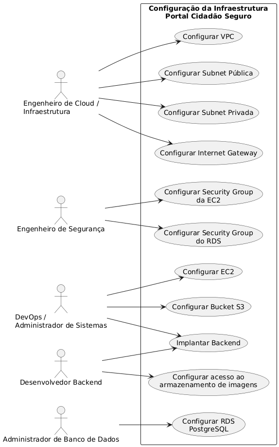
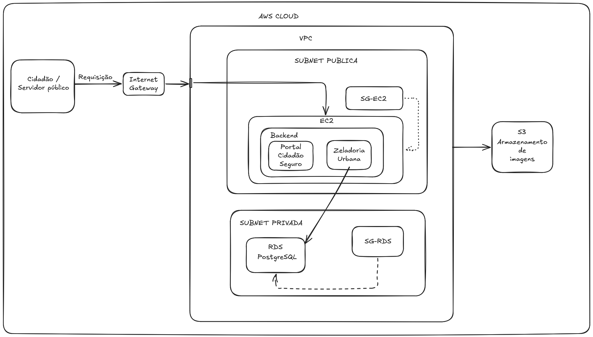
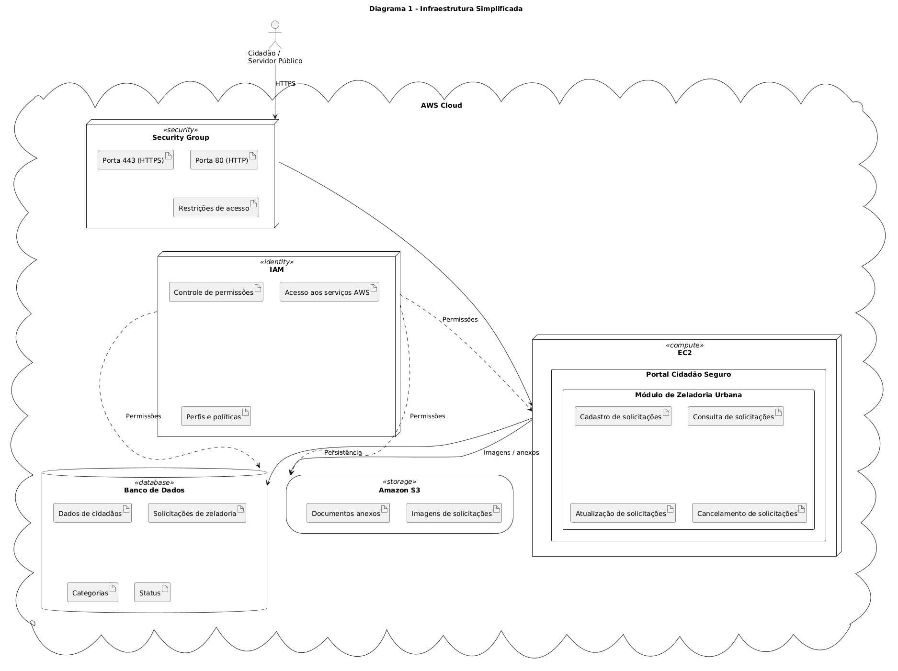
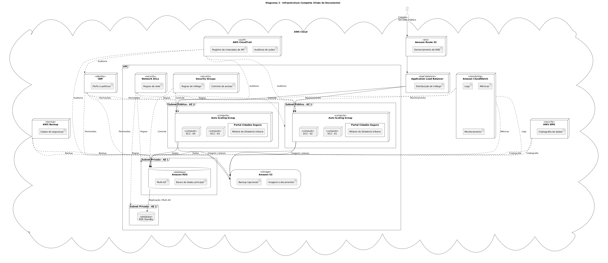
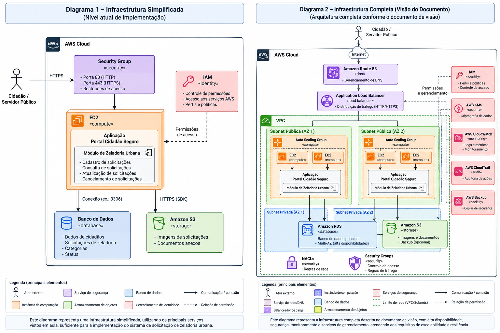

#  Casos de uso arquiteturais

- Tema: GovTech – "Portal Cidadão Seguro"
- Data: 2026.2
- Stakeholder: Caio Domingues - Keanu Santos - Eric Lerer - Gabriel Meireles

---

### 1. Introdução
Este documento descreve as necessidades de negócio, restrições e requisitos de infraestrutura da plataforma SwiftTrack IoT, além de guiar o planejamento arquitetural da solução na nuvem AWS.

### 1.1 Propósito
Definir a visão de escopo e arquitetura lógica/física para a implantação da plataforma SwiftTrack IoT na infraestrutura de nuvem AWS, demonstrando a viabilidade de uma arquitetura resiliente, de alta performance e custo otimizado para o monitoramento de frotas logísticas em tempo real.

### 1.2 Escopo
Os casos de uso arquiteturais abrangem a configuração, operação e manutenção da infraestrutura AWS, incluindo:

- Rede (VPC, sub-redes, rotas, endpoints)
- Segurança (Security Groups, NACLs, IAM)
- Conectividade entre camadas (EC2, RDS)
- Integração com serviços gerenciados (S3)
- Automação e deploy (CI/CD)

---

### 2. VISÃO GERAL DOS CASOS DE USO

### 2.1. Atores

| Stakeholder (Perfil) | Necessidade Primária | Expectativa na Nuvem (AWS) |
|---|---|---|
| **Cidadãos** | Criar, consultar, editar e cancelar solicitações de zeladoria | API disponível e responsiva para realizar as operações de solicitação e acompanhamento |
| **Servidores Públicos** | Analisar solicitações, assumir atendimentos e alterar seus status | Acesso rápido e confiável às solicitações recebidas e aos dados necessários para o atendimento |
| **Engenheiro de Cloud / Infraestrutura** | Configurar e administrar VPC, subnets e Internet Gateway | Infraestrutura de rede organizada, disponível e com conectividade adequada entre os recursos |
| **Engenheiro de Segurança** | Configurar e controlar as regras de acesso aos recursos | Security Groups configurados para restringir acessos não autorizados aos serviços |
| **DevOps / Administrador de Sistemas** | Configurar a EC2 e disponibilizar o backend | Ambiente de computação estável para execução da aplicação |
| **Administrador de Banco de Dados** | Configurar e administrar o banco PostgreSQL | Banco persistente, acessível pela aplicação e protegido contra acessos indevidos |
| **Desenvolvedor Backend** | Desenvolver a aplicação e integrar o backend ao banco e ao S3 | Comunicação confiável entre a aplicação, o banco de dados e o armazenamento de imagens |

## 2.2 Diagrama de casos de Uso

## 3. ESPECIFICAÇÃO DOS CASOS DE USO

---

### UC-ARQ-001: CONFIGURAR VPC E SUB-REDES

| **Elemento** | **Especificação** |
|---|---|
| **Identificador** | UC-ARQ-001 |
| **Nome** | Configurar VPC e Sub-redes |
| **Versão** | 1.0 |
| **Data** | [DD/MM/AAAA] |
| **Status** | Em elaboração |
| **Ator Principal** | Engenheiro de Cloud / Infraestrutura |
| **Ator Secundário** | AWS |
| **Pré-condição** | Conta AWS disponível e permissões necessárias para configuração da VPC. |
| **Pós-condição** | VPC criada com subnet pública para a aplicação e subnet privada para o banco de dados. |

| **Fluxo Principal** | **Passos** |
|---|---|
| 1. | Administrador acessa o Console da AWS. |
| 2. | Acessa o serviço Amazon VPC. |
| 3. | Cria a VPC que será utilizada pelo Portal Cidadão Seguro. |
| 4. | Cria a subnet pública destinada à EC2. |
| 5. | Cria a subnet privada destinada ao banco de dados. |
| 6. | Define a associação dos recursos às respectivas subnets. |
| 7. | Valida a estrutura de rede criada. |

---

### UC-ARQ-002: CONFIGURAR INTERNET GATEWAY

| **Elemento** | **Especificação** |
|---|---|
| **Identificador** | UC-ARQ-002 |
| **Nome** | Configurar Internet Gateway |
| **Versão** | 1.0 |
| **Data** | [DD/MM/AAAA] |
| **Status** | Em elaboração |
| **Ator Principal** | Engenheiro de Cloud / Infraestrutura |
| **Ator Secundário** | AWS |
| **Pré-condição** | VPC criada. |
| **Pós-condição** | Internet Gateway associado à VPC, permitindo conectividade externa para a infraestrutura pública. |

| **Fluxo Principal** | **Passos** |
|---|---|
| 1. | Administrador acessa o serviço Amazon VPC. |
| 2. | Cria um Internet Gateway. |
| 3. | Associa o Internet Gateway à VPC do Portal Cidadão Seguro. |
| 4. | Configura a conectividade necessária para a subnet pública. |
| 5. | Valida a comunicação externa da infraestrutura pública. |

---

### UC-ARQ-003: CONFIGURAR EC2

| **Elemento** | **Especificação** |
|---|---|
| **Identificador** | UC-ARQ-003 |
| **Nome** | Configurar EC2 |
| **Versão** | 1.0 |
| **Data** | [DD/MM/AAAA] |
| **Status** | Em elaboração |
| **Ator Principal** | DevOps / Administrador de Sistemas |
| **Ator Secundário** | AWS |
| **Pré-condição** | VPC e subnet pública configuradas. |
| **Pós-condição** | Instância EC2 criada e disponível para execução do backend do Portal Cidadão Seguro. |

| **Fluxo Principal** | **Passos** |
|---|---|
| 1. | Administrador acessa o serviço Amazon EC2. |
| 2. | Seleciona as configurações necessárias para a instância. |
| 3. | Associa a EC2 à VPC criada. |
| 4. | Associa a instância à subnet pública. |
| 5. | Associa o Security Group correspondente à EC2. |
| 6. | Inicializa a instância. |
| 7. | Configura o ambiente necessário para execução do backend. |
| 8. | Valida o funcionamento da instância. |

---

### UC-ARQ-004: CONFIGURAR SECURITY GROUPS

| **Elemento** | **Especificação** |
|---|---|
| **Identificador** | UC-ARQ-004 |
| **Nome** | Configurar Security Groups |
| **Versão** | 1.0 |
| **Data** | [DD/MM/AAAA] |
| **Status** | Em elaboração |
| **Ator Principal** | Engenheiro de Segurança |
| **Ator Secundário** | AWS |
| **Pré-condição** | VPC criada e recursos definidos. |
| **Pós-condição** | Security Groups associados aos recursos e com regras de tráfego configuradas. |

| **Fluxo Principal** | **Passos** |
|---|---|
| 1. | Administrador acessa a configuração de Security Groups da VPC. |
| 2. | Cria o Security Group destinado à EC2. |
| 3. | Define as regras de tráfego necessárias para acesso à aplicação. |
| 4. | Associa o Security Group à EC2. |
| 5. | Cria o Security Group destinado ao banco de dados. |
| 6. | Define as regras de tráfego necessárias para comunicação entre a aplicação e o banco. |
| 7. | Associa o Security Group ao banco. |
| 8. | Valida as regras de acesso configuradas. |

---

### UC-ARQ-005: CONFIGURAR BANCO DE DADOS

| **Elemento** | **Especificação** |
|---|---|
| **Identificador** | UC-ARQ-005 |
| **Nome** | Configurar Banco de Dados |
| **Versão** | 1.0 |
| **Data** | [DD/MM/AAAA] |
| **Status** | Em elaboração |
| **Ator Principal** | Administrador de Banco de Dados |
| **Ator Secundário** | AWS |
| **Pré-condição** | VPC e subnet privada configuradas. |
| **Pós-condição** | Banco de dados configurado em ambiente privado e acessível pela aplicação. |

| **Fluxo Principal** | **Passos** |
|---|---|
| 1. | Administrador acessa o serviço de banco escolhido para a solução. |
| 2. | Configura o banco de dados. |
| 3. | Associa o banco à estrutura de rede privada. |
| 4. | Associa o Security Group destinado ao banco. |
| 5. | Configura o acesso necessário para a aplicação. |
| 6. | Valida a comunicação entre a EC2 e o banco. |

---

### UC-ARQ-006: CONFIGURAR AMAZON S3

| **Elemento** | **Especificação** |
|---|---|
| **Identificador** | UC-ARQ-006 |
| **Nome** | Configurar Amazon S3 |
| **Versão** | 1.0 |
| **Data** | [DD/MM/AAAA] |
| **Status** | Em elaboração |
| **Ator Principal** | DevOps / Administrador de Sistemas |
| **Ator Secundário** | AWS |
| **Pré-condição** | Conta AWS disponível. |
| **Pós-condição** | Bucket S3 criado para armazenamento de imagens e arquivos do sistema. |

| **Fluxo Principal** | **Passos** |
|---|---|
| 1. | Administrador acessa o serviço Amazon S3. |
| 2. | Cria o bucket destinado ao Portal Cidadão Seguro. |
| 3. | Configura as permissões necessárias para utilização pela aplicação. |
| 4. | Configura o armazenamento das imagens e arquivos enviados pelo sistema. |
| 5. | Valida o acesso da aplicação ao bucket. |

---

### UC-ARQ-007: CONFIGURAR IAM

| **Elemento** | **Especificação** |
|---|---|
| **Identificador** | UC-ARQ-007 |
| **Nome** | Configurar IAM |
| **Versão** | 1.0 |
| **Data** | [DD/MM/AAAA] |
| **Status** | Em elaboração |
| **Ator Principal** | Engenheiro de Segurança |
| **Ator Secundário** | AWS |
| **Pré-condição** | Conta AWS e recursos da solução disponíveis ou planejados. |
| **Pós-condição** | Identidades e permissões configuradas para acesso aos recursos necessários. |

| **Fluxo Principal** | **Passos** |
|---|---|
| 1. | Administrador acessa o serviço AWS IAM. |
| 2. | Identifica os usuários, serviços ou aplicações que necessitam de acesso aos recursos. |
| 3. | Cria ou configura as identidades necessárias. |
| 4. | Define as permissões correspondentes às funções exercidas. |
| 5. | Associa as permissões aos usuários ou serviços. |
| 6. | Valida os acessos concedidos. |

### 4. Arquitetura da Nuvem (AWS)

#### 4.1. Arquitetura da Nuvem sugerida pela IA (menos robusta)

#### 4.2. Arquitetura da Nuvem sugerida pela IA de acordo com doc. de visão

#### 4.2. Arquitetura da Nuvem sugerida pela IA (melhor visualização)

